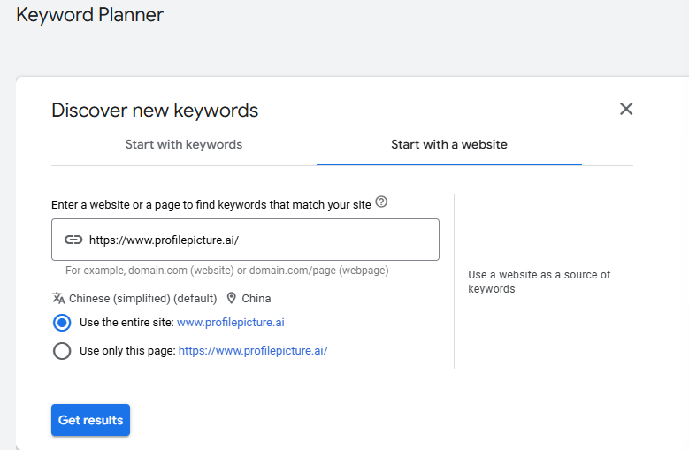
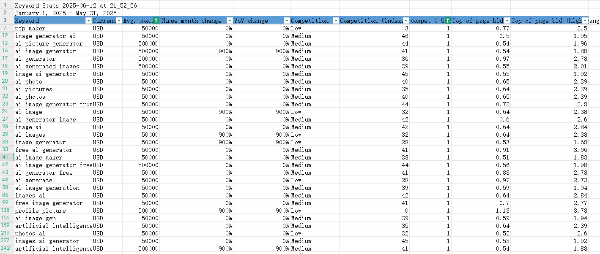
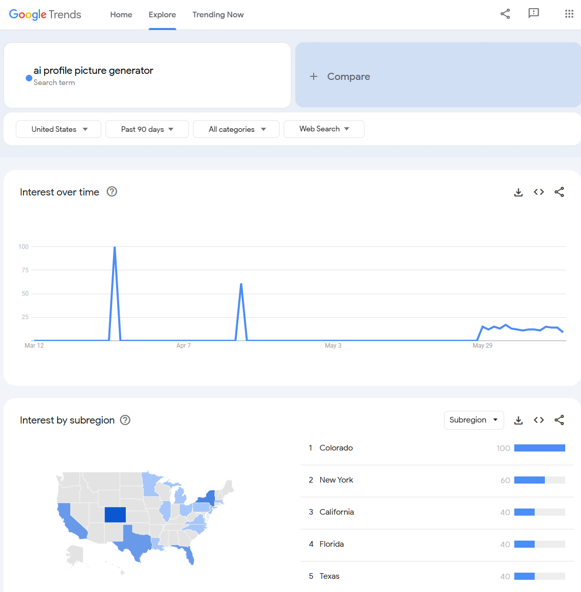
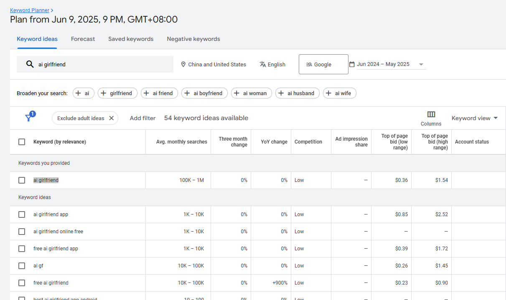
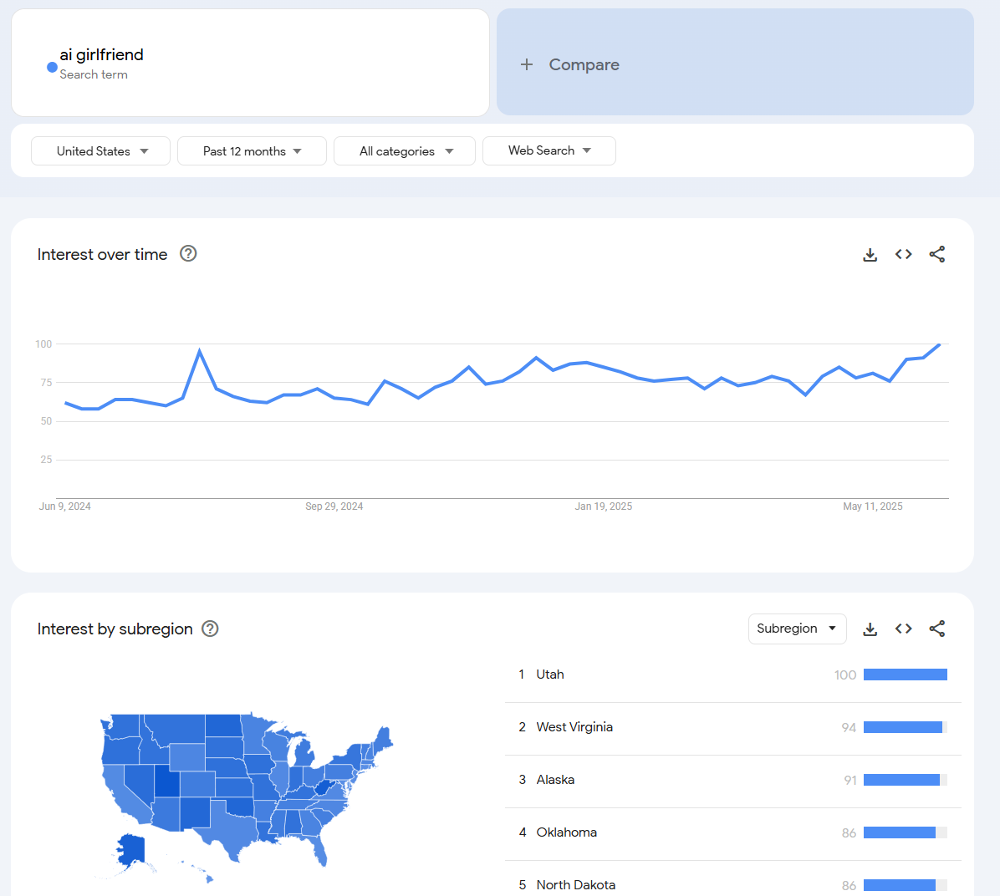
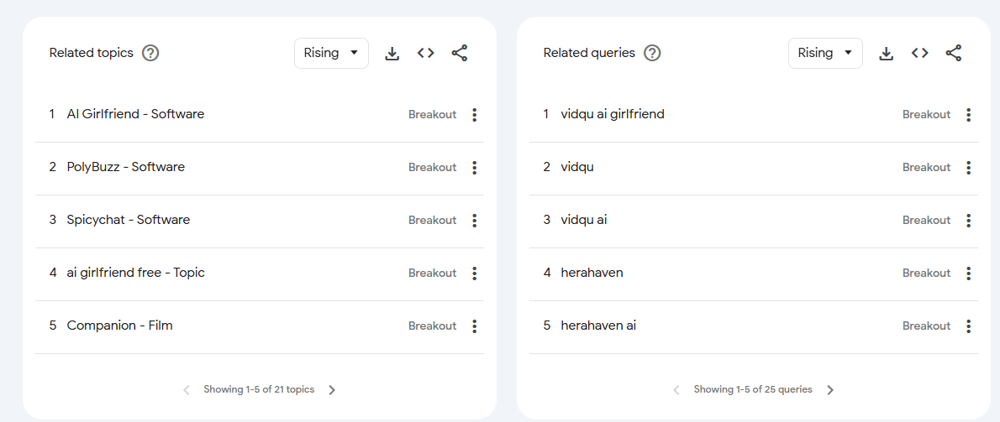

# 从 0 到 1 发现需求，开发上线一个海外 web 站点

## 图片类的网站如何找到需求并实现：

1. 查看 AI 图片类榜单（推荐工具：toolify.ai）
2. 使用工具导出网站关键词（推荐工具：Google keyword Planer,SEMRush 等）
3. 使用关键词工具调研，找到值得做的需求(./利用关键词工具...找到值得做的需求.md)
4. 实现需求 - 使用模板或者 AI 协助开发：
   - https://vercel.com (服务器)练习上站
   - https://supabase.com (DB)
   - https://www.astria.ai (API KEY)
5. 网站优化和推广（发外链）（可以用 ahrefs 工具查看竞品的发外链目标地）- 如何发外链？
6. 重复 1~5 步骤

## 上站实践：

1. 找到一个图片类网站，https://www.profilepicture.ai/，从它下手，先分析一下它的关键词 

   - 用 keywords planer 查网站关键词
     
     
     

   - 选 keywords 关键词，并判断出是否可以做（需要经验积累与一些感觉判断），尽量找新词
     - 找关键词
       
     - 查看关键词趋势
       
     - 关键词相关
       

   - 分析结果，没分析出什么来，直接仿制 profilepicture.ai 吧

2. 使用模板直接发布网站（可以在 github 上找模板或者在 vercel.com 上找模板）可以先随意找几个模板试一下流程
3. 在 vercel.com 选好模板，deploy，然后关联 vercel 和 github 的账号（如已关联，跳过关联步骤）
4. 在 https://supabase.com 创建数据库
5. 在 https://www.astria.ai 创建密钥
6. 部署成功后，再上线域名等，修改 DNS 等
7. 网站优化和推广
8. 其他：
   - 免费域名 Dot.tk
   - https://www.infinityfree.com/
   - vercel.com 也会生成一个免费域名
   - cloudflare.com
   - https://pages.github.com/
9. Next.js 的网站建议在 vercel.com 上发，HTML 静态页面在 cloudflare 上发
10. 数据分析与网站调整：
    - Google Search Console (这个工具需要查一下)
    - Google Analytics
    - 注册的账号密码要牢记

