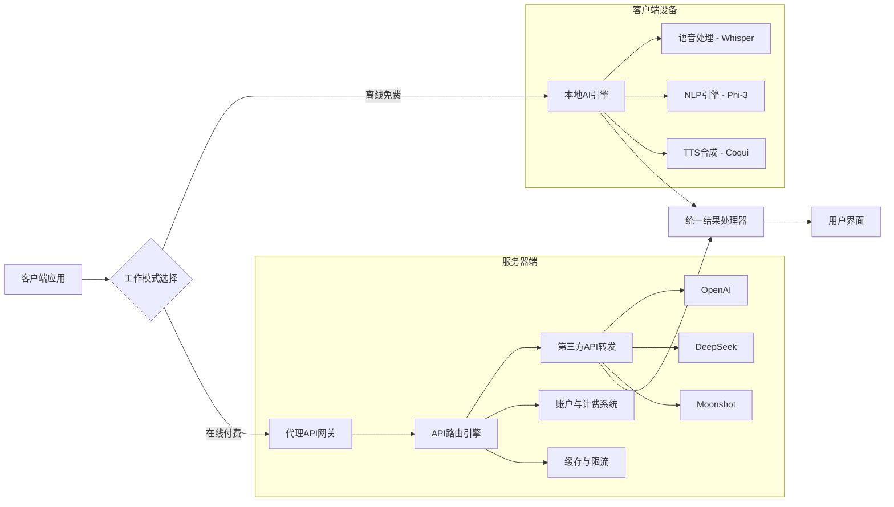
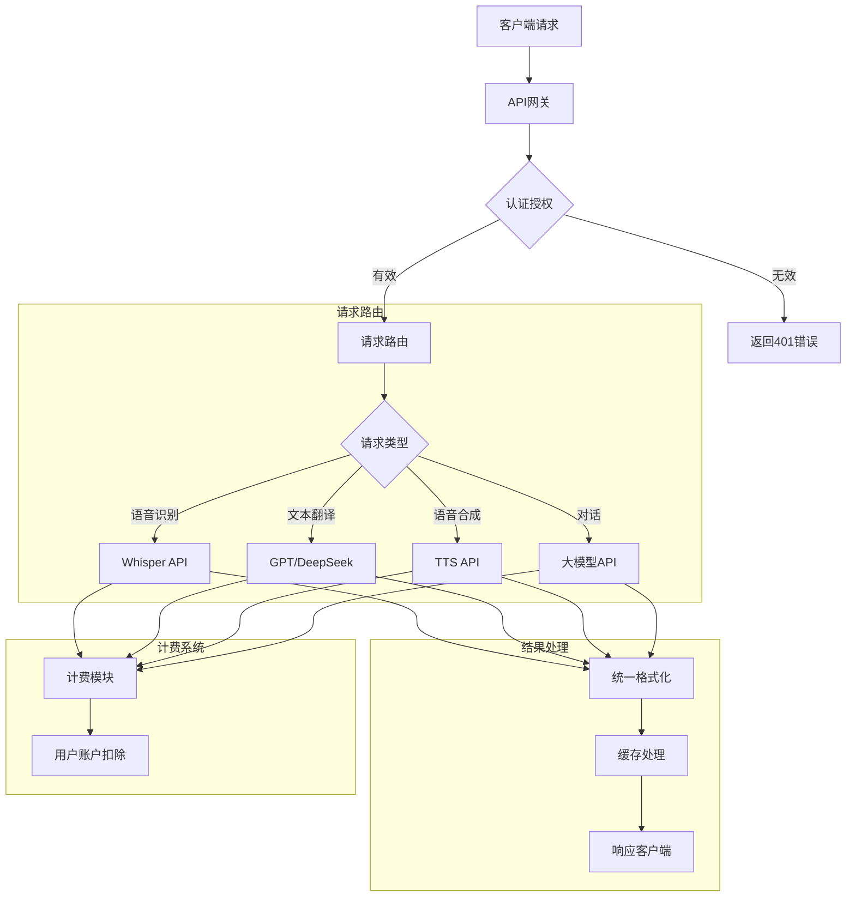
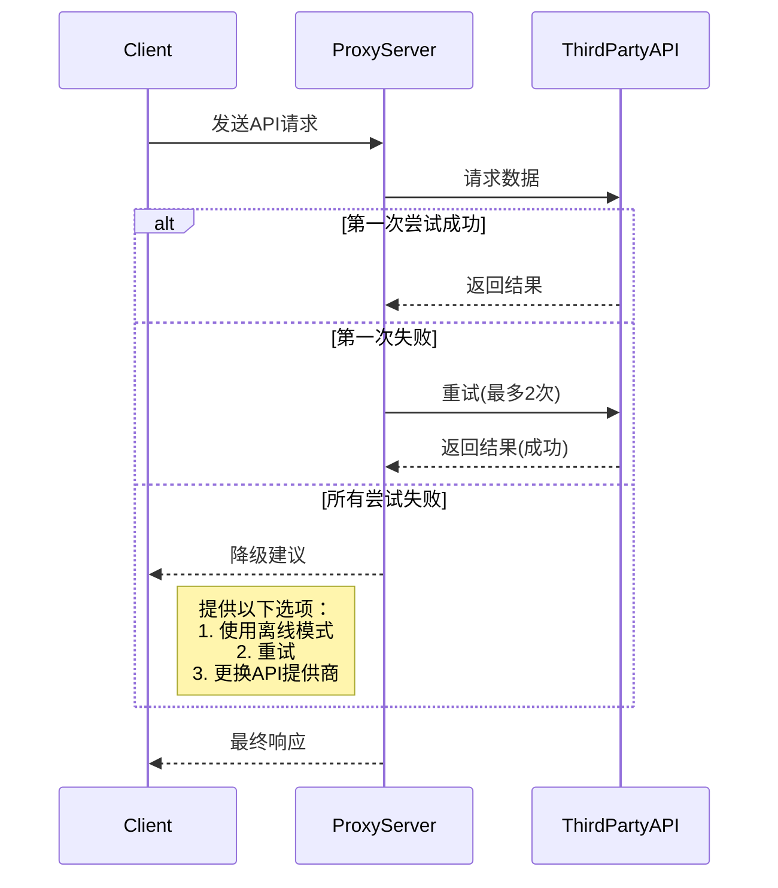

# 离线与在线双引擎设计方案（免费本地+付费API）


## 系统架构总览



## 核心设计要素

### 1. 客户端代理网关模块

```python
class AIProxyGateway:
    def __init__(self):
        self.mode = "offline"  # 默认为离线模式
        self.server_endpoint = "https://your-proxy-server.com/api"
        self.token = None
        
    def set_mode(self, mode, token=None):
        """设置工作模式"""
        self.mode = mode
        if mode == "online" and token:
            self.token = token
    
    def process_request(self, request_type, data):
        """
        统一处理请求
        request_type: speech, translate, tts, dialogue
        """
        if self.mode == "offline":
            return self._process_offline(request_type, data)
        else:
            return self._process_online(request_type, data)
    
    def _process_offline(self, request_type, data):
        """本地离线处理"""
        if request_type == "speech":
            return whisper.process_audio(data)
        elif request_type == "translate":
            return phi3.translate(data)
        # ...其他类型处理
    
    def _process_online(self, request_type, data):
        """通过服务器代理访问API"""
        payload = {
            "type": request_type,
            "data": data,
            "token": self.token
        }
        
        try:
            response = requests.post(
                f"{self.server_endpoint}/process",
                json=payload,
                timeout=10
            )
            return response.json()
        except Exception as e:
            return {"error": str(e), "fallback": "offline"}
```

### 2. 服务器端代理架构设计



### 3. 服务器端API路由实现（Node.js示例）

```javascript
const express = require('express');
const router = express.Router();
const { OpenAI } = require('openai');
const { DeepSeek } = require('deepseek-api');

// 创建API客户端实例
const apiClients = {
    openai: new OpenAI({ apiKey: process.env.OPENAI_KEY }),
    deepseek: new DeepSeek({ apiKey: process.env.DEEPSEEK_KEY }),
    // 其他API提供商
};

router.post('/process', async (req, res) => {
    const { token, type, data } = req.body;
    
    try {
        // 验证用户token和配额
        const user = await validateToken(token);
        if (!user || !user.activeSubscription) {
            return res.status(403).json({ error: 'Invalid token or no active subscription' });
        }
        
        // 选择最佳API提供商
        const provider = selectProvider(type, user.preference);
        
        // 处理请求
        let result;
        switch (type) {
            case 'speech':
                result = await apiClients[provider].transcribe(data.audio);
                break;
            case 'translate':
                result = await apiClients[provider].translate(
                    data.text, 
                    data.source_lang, 
                    data.target_lang
                );
                break;
            case 'tts':
                result = await apiClients[provider].synthesize(data.text, data.voice);
                break;
            // 其他类型处理...
        }
        
        // 计算消耗并更新账户
        const cost = calculateCost(type, result);
        await deductBalance(user.id, cost);
        
        res.json({ result, cost, provider });
        
    } catch (error) {
        console.error('API processing error:', error);
        res.status(500).json({ error: 'Internal server error' });
    }
});

// 选择最优API提供商
function selectProvider(type, preference) {
    const providerPriority = {
        openai: ['speech', 'dialogue', 'translation'],
        deepseek: ['translation', 'dialogue']
    };
    
    if (preference && providerPriority[preference].includes(type)) {
        return preference;
    }
    
    // 默认逻辑：选择第一优先级
    for (const provider in providerPriority) {
        if (providerPriority[provider].includes(type)) {
            return provider;
        }
    }
    
    return 'openai'; // 默认退回OpenAI
}
```

## 核心优势功能

### 1. 智能故障切换系统


### 2. 统一账户与计费系统

| 功能         | 实现方案                     | 优势特点                     |
|--------------|------------------------------|------------------------------|
| 多套餐订阅   | 基本/专业/企业三级套餐       | 满足不同用户需求             |
| 统一计费     | 以Token计算消耗              | 跨API提供商可比              |
| 余额保护     | 接近限额时通知/自动停机      | 防止意外超额                 |
| 用量仪表盘   | 实时显示消费情况             | 透明消费体验                 |
| 跨设备同步   | 基于账户的服务              | 多设备无缝使用               |

### 3. 高级缓存优化策略

```python
class ResponseCache:
    def __init__(self):
        self.cache = {}
        self.stats = {}
        
    def get_key(self, request_type, data):
        """生成缓存键"""
        if request_type == 'speech':
            return f"audio_md5:{md5(data.audio)}"
        elif request_type == 'translate':
            return f"trans_{data.source}_{data.target}:{md5(data.text)}"
        # 其他类型...
    
    def check_cache(self, key):
        """检查缓存并更新统计"""
        if key in self.cache:
            self.stats[key] = self.stats.get(key, 0) + 1
            return self.cache[key]
        return None
    
    def add_to_cache(self, key, result, ttl=3600):
        """添加结果到缓存"""
        self.cache[key] = {
            'result': result,
            'expire': time.time() + ttl,
            'hits': 0
        }
        
    def remove_expired(self):
        """清理过期缓存"""
        # 清理逻辑...

# 使用示例
cache = ResponseCache()

def handle_request(request):
    key = cache.get_key(request.type, request.data)
    cached = cache.check_cache(key)
    if cached:
        return cached
    
    # 未命中缓存时处理请求
    result = process_request(request)
    cache.add_to_cache(key, result)
    return result
```

## 开发路线图

### 阶段1：基础架构搭建 (4周)
1. 实现服务器端代理网关
2. 完成OpenAI接口对接
3. 开发基本计费系统
4. 客户端基本通信模块

### 阶段2：高级功能开发 (6周)
1. 多API提供商支持（DeepSeek, Moonshot）
2. 实现智能路由和负载均衡
3. 构建缓存优化系统
4. 开发用户仪表盘和通知系统

### 阶段3：混合模式优化 (4周)
1. 实现无缝离线/在线切换
2. 开发降级策略和错误处理
3. 创建API健康监控系统
4. 安全审计和性能优化

## 关键考量点

### 1. 安全架构设计
| 安全隐患         | 防御措施                                 |
|------------------|------------------------------------------|
| API密钥泄露      | 代理加密存储+访问隔离+轮换机制           |
| DDoS攻击         | Cloudflare防护+请求限流                  |
| 中间人攻击       | E2EE端到端加密+证书锁定                  |
| 数据隐私         | 匿名请求+严格日志策略+GDPR合规           |
| 未授权访问       | JWT验证+IP过滤+用户级配额控制            |

### 2. 性能优化策略
- **地理加速**：在全球部署边缘节点
  - 亚洲：东京、新加坡
  - 欧洲：法兰克福、伦敦
  - 北美：硅谷、弗吉尼亚
- **连接优化**：
  - HTTP/3支持
  - QUIC协议
  - WebSocket持久连接
- **数据压缩**：
  - Brotli高效压缩
  - 协议缓冲区替代JSON

### 3. 商业模式设计


## 总结建议

1. **初期最小可行性产品(MVP)版本**
   - 仅支持OpenAI代理和基础离线功能
   - 简单按请求次数的计费系统
   - 逐步迭代更复杂的特性

2. **优先使用体验优化**
   - 一键切换离线/在线模式
   - 每次请求清晰显示消费金额
   - 离线模式下标注功能限制提醒

3. **扩展性架构设计**
   ```python
   class ProviderPlugin:
       def __init__(self, name):
           self.name = name
           
       def translate(self, text, source, target):
           """实现具体API调用"""
           
   # 注册新API提供商
   def register_provider(plugin):
       global providers
       providers[plugin.name] = plugin
   ```

4. **免费增值策略**
   - 提供每日免费配额（如100次请求）
   - 免费版仅在凌晨使用代理服务
   - 通过推荐系统获得额外免费额度