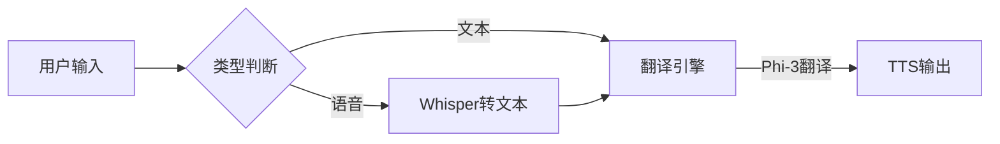

英语学习工具设计的开发方案

---

### **一、离线大模型推荐**
#### 1. **语音转文字（STT）**
- **Whisper.cpp**（OpenAI Whisper的C++移植版）
  - 支持多语言，英语识别精度高
  - 轻量化模型可选（tiny/base/small）
  - 资源占用：tiny版仅需约80MB内存，适合离线部署
  - 许可证：MIT（可商用）

#### 2. **文本生成与翻译**
- **Phi-3-mini**（微软）
  - 参数：3.8B，支持中英双语
  - 优势：专为边缘设备优化，可在4GB内存设备运行
  - 性能：接近7B模型的翻译质量
  - 许可证：MIT
  
- **Llama 3**（Meta）
  - 推荐版本：Llama-3-8B-Instruct（4-bit量化版）
  - 支持长上下文（128K token），适合对话场景
  - 工具链：可通过llama.cpp本地部署
  - 许可证：需遵守Meta商业使用政策

#### 3. **文字转语音（TTS）**
- **Coqui TTS**
  - 支持离线部署，提供预训练英文模型（如Tacotron2）
  - 轻量化模型：可选用FastSpeech2（<100MB）
  - 定制化：支持用户导入发音库微调

---

### **二、开发规划（分三期）**
#### **第一期：核心功能实现（8-10周）**
| 模块              | 技术方案                                                                 | 产出目标                                                                 |
|-------------------|------------------------------------------------------------------------|--------------------------------------------------------------------------|
| **架构搭建**      | 采用Electron + Rust（本地计算密集型任务）                                | 安装包<500MB，支持Win/MacOS                                              |
| **语音转文字**    | 集成Whisper.cpp，预置tiny模型                                            | 实现麦克风输入→实时文字转录（响应延迟<1秒）                                |
| **中英互译**      | 部署Phi-3-mini（4-bit量化版），封装翻译API                                | 支持段落级翻译，响应速度≤3秒（i5处理器）                                    |
| **文字转语音**    | 集成Coqui TTS基础英文模型                                                 | 实现文本朗读+语速调节功能                                                 |
| **本地数据库**    | SQLite存储用户学习记录                                                   | 支持学习进度保存/查询                                                    |

#### **第二期：跟读训练功能（6-8周）**
| 功能              | 实现方案                                                                 |
|-------------------|------------------------------------------------------------------------|
| **实时跟读评分**  | 结合DTW（动态时间规整）算法对比用户录音与标准发音                       |
| **发音可视化**    | 波形图+音素比对（使用OpenStyle语音特征提取库）                          |
| **错词本**        | 自动记录发音不准的单词，提供针对性练习                                  |

#### **第三期：高阶优化（4周）**
- **模型压缩**：将Phi-3替换为蒸馏版小模型（如TinyLlama-1.1B）
- **语音延迟优化**：实现硬件加速（通过WebGPU运行ONNX模型）
- **增量更新**：允许用户下载更高精度模型（如Whisper-medium）
- **安全加固**：敏感操作（如麦克风访问）增加系统级权限认证

---

### **三、关键技术实现**
#### 1. **离线翻译工作流**


#### 2. **跟读评分算法逻辑
```python
# 伪代码示例
def score_pronunciation(user_audio, ref_audio):
    user_mfcc = extract_mfcc(user_audio)  # 提取梅尔频谱
    ref_mfcc = extract_mfcc(ref_audio)
    
    # 动态时间规整计算相似度
    dtw_distance = dtw(user_mfcc, ref_mfcc).distance
    
    # 音素级对比
    phoneme_diff = compare_phonemes(user_audio, ref_audio)
    
    return 100 - dtw_distance * 0.5 - phoneme_diff * 20
```

---

### **四、资源预算建议**
| 项目                | 推荐配置                                  |
|---------------------|------------------------------------------|
| 最低系统要求        | 4核CPU/8GB内存/2GB显存（Intel UHD630+）    |
| 硬盘空间            | 基础安装包300MB（可扩展至2GB含高清模型）     |
| 开发重点成本        | Rust/Electron集成优化（预计需3个月）        |

---

### **五、避坑指南**
1. **语音延迟优化**：使用Web Worker分离UI线程与语音处理
2. **模型加载加速**：预加载高频功能模型（如Whisper-tiny）
3. **隐私保护**：明确告知用户数据永不联网（通过系统权限弹窗实现）
4. **离线更新机制**：设计模型包签名验证防止篡改

建议优先开发MVP版本（含语音转写+基础翻译），快速验证核心功能后迭代添加AI对话模块。对于发音评分功能，初期可先用DTW算法实现基础评分，后期再升级为基于LSTM的深度评分模型。