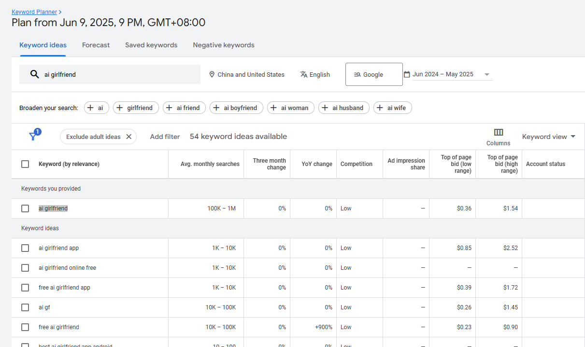
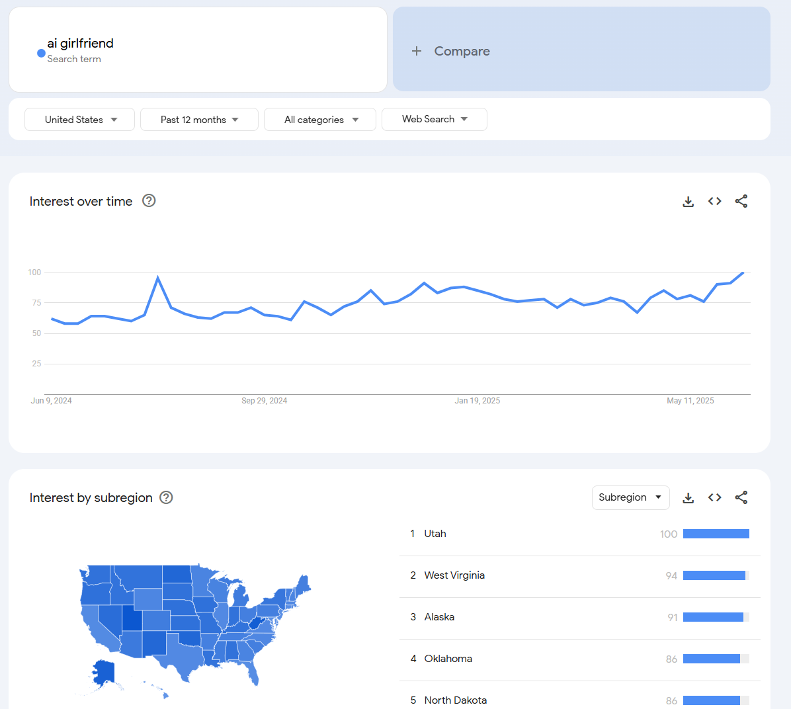
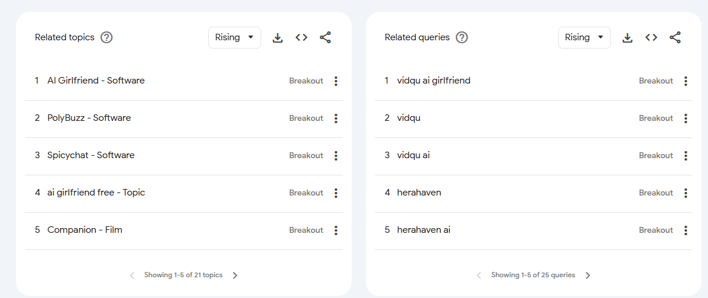

# 从0到1发现需求，开发上线一个海外web站点

## 图片类的网站如何找到需求并实现：
	1. 查看AI图片类榜单（推荐工具：toolify.ai）
	2. 使用工具导出网站关键词（推荐工具：Google keyword Planer,SEMRush等）
	3. 使用关键词工具调研，找到值得做的需求(./利用关键词工具...找到值得做的需求.md)
	4. 实现需求 - 使用模板或者AI协助开发：
		使用 https://vercel.com 练习上站 
		https://supabase.com (DB) 
		https://www.astria.ai (API KEY)
	5. 网站优化和推广 （发外链）（可以用 ahrefs 工具查看竞品的发外链目标地）- 如何发外链？
	6. 重复 1~5 步骤
	

## 上站实践：
	0. 选keywords关键词，并判断出是否可以做（需要经验积累与一些感觉判断），尽量找新词
		- 找关键词
		
		- 查看关键词趋势
		
		- 关键词相关
		

	1. 使用 模板直接发布 网站 （可以在github上找模板或者在 vercel.com 上找模板）可以先随意找几个模板试一下流程
	2. 在 vercel.com 选好模板，deploy,然后关联vercel和github的账号（如已关联，跳过关联步骤）
	3. 在 https://supabase.com 创建数据库
	4. 在 https://www.astria.ai  创建密钥
	5. 部署成功后，再上线域名等，修改DNS等
	6. 网站优化和推广
	7. 其他：（免费域名 Dot.tk, https://www.infinityfree.com/  vercel.com也会生成一个免费域名，还有cloudflare.com， https://pages.github.com/ 等）
	8. Next.js的网站建议在vercel.com上发, HTML静态页面在cloudflare上发
	9. 数据分析与网站调整：Google Search Console (这个工具需要查一下); Google Analytics;注册的账号密码要牢记
	