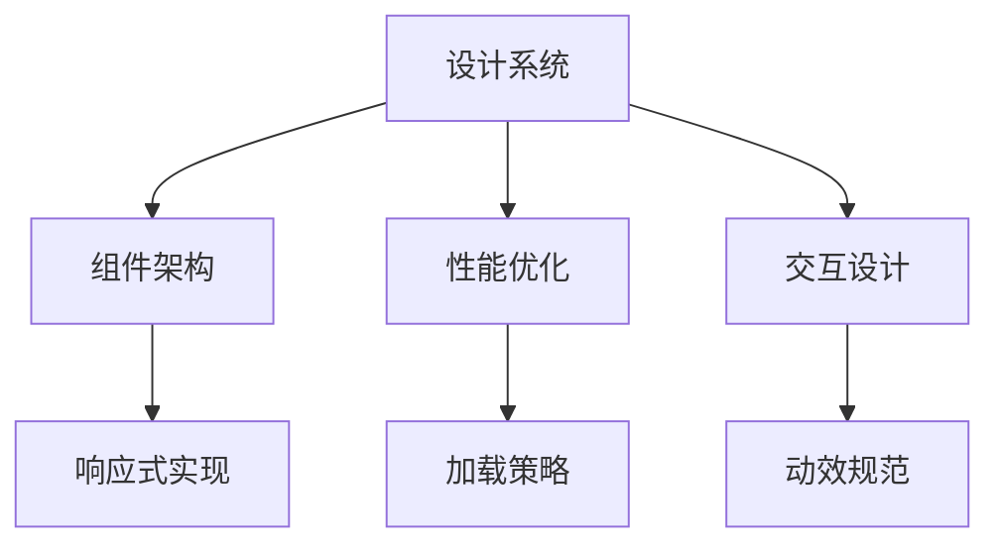
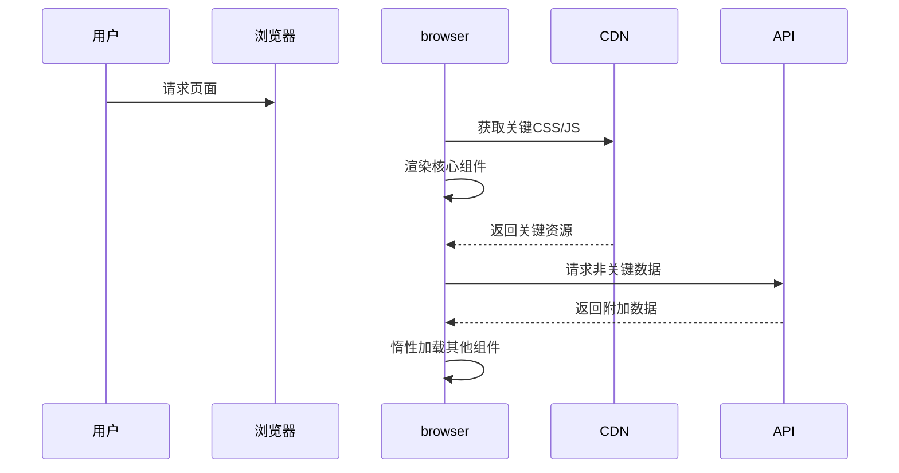
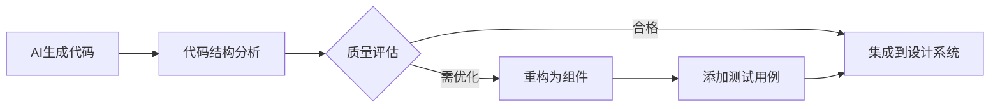
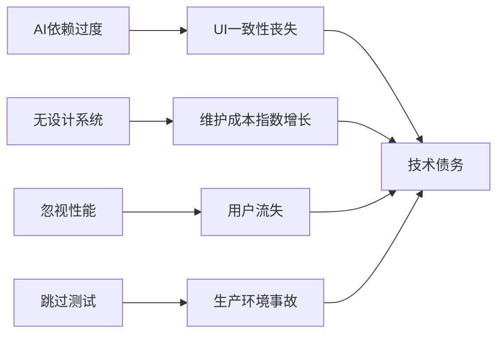

# 前端UI开发最佳策略指南：AI时代的专业实践


## 🌐 核心UI开发原则框架



## 一、设计系统优先策略（核心基础）

### 1.1 建立设计令牌系统
```js
// design-tokens.js
export const colors = {
  primary: '#3A86FF',
  secondary: '#FFBE0B',
  success: '#4BB543',
  error: '#FF3860',
  text: {
    primary: '#212121',
    secondary: '#757575'
  }
};

export const spacing = {
  sm: '8px',
  md: '16px',
  lg: '24px',
  xl: '32px'
};
```

### 1.2 组件驱动开发工作流
```
1. 与AI协作流程：
   需求 → AI生成初稿 → 人工审核 → 转化为设计系统组件
2. 组件分类：
   - 原子组件：按钮/输入框/图标
   - 分子组件：卡片/导航栏/表单
   - 模版组件：页面布局框架
```

### 1.3 实用工具类系统（如Tailwind进阶）
```html
<!-- 避免过度定制 -->
<button class="btn btn-primary">确认</button>
<!-- 替代 -->
<button class="bg-primary hover:bg-primary-dark text-white px-4 py-2 rounded transition">
  确认
</button>
```

## 二、响应式设计实现策略

### 2.1 断点策略（移动优先）
```css
/* 基准（移动） */
.container {
  padding: var(--spacing-md);
}

/* 平板的适配 */
@media (min-width: 768px) {
  .container {
    padding: var(--spacing-lg);
  }
}

/* 桌面适配 */
@media (min-width: 1024px) {
  .container {
    max-width: 1200px;
    margin: 0 auto;
  }
}
```

### 2.2 响应式布局技术选型
| 技术          | 适用场景                  | AI协作要点               |
|---------------|-------------------------|-------------------------|
| CSS Grid      | 二维复杂布局              | 生成基础网格框架          |
| Flexbox       | 一维元素排列              | 快速原型实现              |
| 容器查询      | 组件级响应式              | AI不易掌握，需手动实现    |
| 视口单位(vw/vh)| 全屏布局                  | AI可生成基础应用         |

## 三、性能驱动设计策略

### 3.1 渲染性能优化清单
```javascript
// React组件优化示例
const HeavyComponent = React.memo(({ data }) => {
  // 使用虚拟化长列表
  return (
    <FixedSizeList height={600} itemCount={1000} itemSize={35} width="100%">
      {({ index, style }) => (
        <div style={style}>Item {index}</div>
      )}
    </FixedSizeList>
  );
});
```

### 3.2 加载策略优化


### 3.3 AI在性能优化中的应用
```python
# 与AI协作的优化建议获取
prompt = """
以下React组件存在性能问题：
```
{组件代码}
```
请提供具体的优化建议，包括：
1. 不必要的渲染分析
2. 依赖数组优化点
3. 复杂计算提取方案
"""
response = ai_client.generate_code_review(prompt)
```

## 四、交互与动效专业实践

### 4.1 动效设计原则
```js
// 推荐动画库：Framer Motion
const fadeIn = {
  initial: { opacity: 0, y: 20 },
  animate: { 
    opacity: 1, 
    y: 0,
    transition: {
      duration: 0.3,
      ease: "easeOut"
    }
  },
  exit: { opacity: 0 }
};

<Card variants={fadeIn} initial="initial" animate="animate" />
```

### 4.2 交互反馈体系
| 交互类型      | 反馈机制                  | 实现要点                |
|--------------|-------------------------|------------------------|
| 用户操作      | 微动效 + 即时视觉反馈     | 按钮点击效果           |
| 加载状态      | 骨架屏 + 占位内容         | 避免布局跳动           |
| 数据提交      | 进度指示 + 结果通知       | 错误处理要明确         |

### 4.3 AI原型生成技巧
```
提示词模板：
"生成一个{电商产品}页面的交互原型，包含：
1. 图片画廊（支持手势滑动）
2. 尺寸选择器
3. 加入购物车动效
要求：
- 使用Framer Motion库
- 响应式设计
- 提取可复用交互组件"
```

## 五、AI协作专项策略

### 5.1 AI生成代码处理流程


### 5.2 提示词工程实践
```markdown
**高质量UI提示词要素：**
1. 设计参考：提供具体UI库/设计系统名称
   - "遵循Material Design 3规范"
   
2. 技术要求：
   - "使用CSS Grid实现布局"
   - "支持暗色模式"
   
3. 约束条件：
   - "移动优先响应式"
   - "无障碍标准AA级"
   
4. 组件结构：
   - "导出为React函数组件"
   - "Props包含size, variant"
```

### 5.3 AI生成UI验收清单
1. **代码质量检查**
   ```bash
   eslint --fix AI-generated.js
   ```
2. **功能验证**
   ```js
   // 添加单元测试
   test('按钮点击回调触发', () => {
     const handleClick = jest.fn();
     render(<Button onClick={handleClick}>点击</Button>);
     fireEvent.click(screen.getByText('点击'));
     expect(handleClick).toHaveBeenCalled();
   });
   ```
3. **性能评估**
   ```javascript
   // React Profiler分析
   <React.Profiler id="AIComponent" onRender={onRenderCallback}>
     <AIGeneratedComponent />
   </Profiler>
   ```

## 六、专业工具箱推荐

### 6.1 现代UI开发技术栈
| 类别         | 推荐工具                  | AI协作场景            |
|--------------|--------------------------|----------------------|
| 框架         | React/Vue 3              | 组件生成/代码补全     |
| 样式方案     | Tailwind CSS + CSS Modules | 设计系统实现          |
| 状态管理     | Zustand/Jotai            | 复杂状态逻辑生成      |
| 动画         | Framer Motion             | 交互原型生成          |

### 6.2 AI增强开发工具
1. **Codeium**：IDE智能补全
2. **Figma AI**：设计稿转代码
3. **Vercel v0**：AI生成可部署UI组件
4. **Builder.io**：可视化AI组件生成

## 七、避免常见陷阱



**专业建议：**
1. 保留设计决策权：AI建议，人类决策
2. 建立UI回归测试
   ```bash
   # 视觉回归测试
   npx playwright screenshot --full-page
   ```
3. 制定AI使用规范：
   - 生成代码必须包含文档注释
   - 复杂逻辑需添加单元测试
   - 重要组件需人工审核

总结：AI是强大的辅助工具，但人类的设计智慧和系统思维仍不可替代。