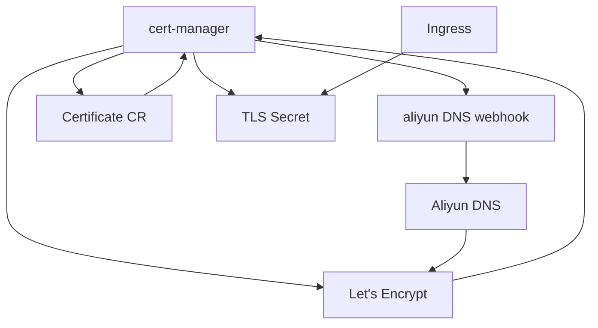

# Kubernetes 中基于 cert-manager + Let’s Encrypt + 阿里云 DNS 的自动化 TLS 证书管理实践

> 作者：AI
> 适用场景：Kubernetes / 阿里云 DNS / 通配符证书 / 自动续期

---

## 一、背景与问题

在 Kubernetes 集群中，HTTPS 已经是**默认要求**，但证书管理在实际生产中常常存在以下问题：

* 证书由人工申请、上传、续期，**易忘记、易出错**
* 多环境（dev / test / prod）证书混乱
* 子域名数量多，**单域名证书维护成本高**
* 内网集群或未暴露公网 IP，无法使用 HTTP-01 验证

为了解决这些问题，我们在生产环境中落地了一套 **基于 cert-manager + Let’s Encrypt + 阿里云 DNS 的自动证书管理方案**，实现：

* 证书自动申请
* 自动续期
* 支持通配符域名
* 与 Ingress 无缝集成
* 全流程无人值守

本文将完整介绍该方案的**设计思路、实现方式以及关键注意事项**。

---

## 二、方案选型

### 1️⃣ 为什么选择 cert-manager？

cert-manager 是 Kubernetes 官方事实标准的证书管理方案：

* Kubernetes 原生 CRD（Certificate / Issuer）
* 自动化生命周期管理
* 与 Ingress、Gateway 等组件深度集成
* 社区成熟，生产验证充分

---

### 2️⃣ 为什么选择 Let’s Encrypt？

* 免费
* 自动化接口（ACME 协议）
* 被所有主流浏览器信任
* 支持通配符证书（DNS-01）

---

### 3️⃣ 为什么选择 DNS-01 验证？

| 验证方式        | 是否支持通配符 | 是否依赖公网 |
| ----------- | ------- | ------ |
| HTTP-01     | ❌       | ✅      |
| TLS-ALPN-01 | ❌       | ✅      |
| **DNS-01**  | ✅       | ❌      |

**DNS-01 是通配符证书和内网集群的唯一可行解。**

---

## 三、整体架构设计

### 架构组件说明

* **cert-manager**：证书生命周期管理控制器
* **cert-manager-webhook-aliyun**：阿里云 DNS API 适配器
* **Let’s Encrypt ACME Server**：证书颁发机构
* **阿里云 DNS**：完成 DNS-01 验证
* **Ingress Controller**：消费 TLS Secret

### 架构流程图



---

## 四、前置条件

### Kubernetes 环境

* Kubernetes ≥ 1.16
* Helm ≥ 3.x
* 集群可访问公网（访问 ACME Server）

### 域名与 DNS

* 域名托管在阿里云 DNS
* 具备 DNS API 调用权限

---

## 五、核心实现步骤

### 1️⃣ 安装 cert-manager

```bash
helm repo add jetstack https://charts.jetstack.io
helm repo update

kubectl create namespace cert-manager

helm install cert-manager jetstack/cert-manager \
  -n cert-manager \
  --set installCRDs=true
```

---

### 2️⃣ 安装阿里云 DNS Webhook

cert-manager 通过 webhook 调用阿里云 DNS API：

```bash
helm repo add alidns-webhook https://devmachine-fr.github.io/cert-manager-alidns-webhook
helm repo update

helm install alidns-webhook alidns-webhook/alidns-webhook \
  -n cert-manager
```

---

### 3️⃣ 配置阿里云 AccessKey

> ⚠️ 建议使用 **最小权限的 RAM 子账号**

```yaml
apiVersion: v1
kind: Secret
metadata:
  name: aliyun-dns-secret
  namespace: cert-manager
type: Opaque
stringData:
  access-key-id: <ALIYUN_ACCESS_KEY_ID>
  access-key-secret: <ALIYUN_ACCESS_KEY_SECRET>
```

---

### 4️⃣ 创建 ClusterIssuer（Staging + Production）

#### Staging（强烈建议先验证）

```yaml
apiVersion: cert-manager.io/v1
kind: ClusterIssuer
metadata:
  name: letsencrypt-staging
spec:
  acme:
    server: https://acme-staging-v02.api.letsencrypt.org/directory
    email: admin@example.com
    privateKeySecretRef:
      name: letsencrypt-staging-account-key
    solvers:
    - dns01:
        webhook:
          groupName: acme.yunxiao.com
          solverName: alidns
          config:
            regionId: cn-hangzhou
            accessKeySecretRef:
              name: aliyun-dns-secret
              key: access-key-id
            secretKeySecretRef:
              name: aliyun-dns-secret
              key: access-key-secret
```

> ⚠️ **groupName 必须与 webhook 配置一致，否则会导致参数解析失败**

---

### 5️⃣ 申请通配符证书

```yaml
apiVersion: cert-manager.io/v1
kind: Certificate
metadata:
  name: wildcard-example-com
  namespace: default
spec:
  secretName: wildcard-example-com-tls
  dnsNames:
  - example.com
  - "*.example.com"
  issuerRef:
    name: letsencrypt-prod
    kind: ClusterIssuer
```

---

### 6️⃣ Ingress 使用证书

```yaml
spec:
  tls:
  - hosts:
    - app.example.com
    secretName: wildcard-example-com-tls
```

---

## 六、监控与告警

cert-manager 内置 Prometheus 指标，可监控：

* 证书到期时间
* 续期失败次数
* 证书 Ready 状态

建议至少配置：

* 30 天到期告警
* 续期失败告警

---

## 七、常见问题与踩坑总结

### 1️⃣ DNS 验证失败

* AccessKey 权限不足
* groupName / solverName 不一致
* TXT 记录未及时生效

### 2️⃣ cert-manager 不续期

* renewBefore 配置过小
* Issuer 异常
* ACME 限流

---

## 八、最佳实践总结

* **先 staging，后 production**
* **通配符证书优先**
* **最小权限 RAM 用户**
* **证书与 Ingress 解耦**
* **监控必不可少**

---

## 九、适用场景与限制

### 适用

* 多子域名
* 内网集群
* 多环境 Kubernetes

### 不适用

* 无 DNS API 权限
* 极端高频证书创建场景

---

## 十、结语

通过 cert-manager + Let’s Encrypt + DNS-01 验证，我们在生产环境中实现了 **真正的 TLS 证书“零运维”**。
